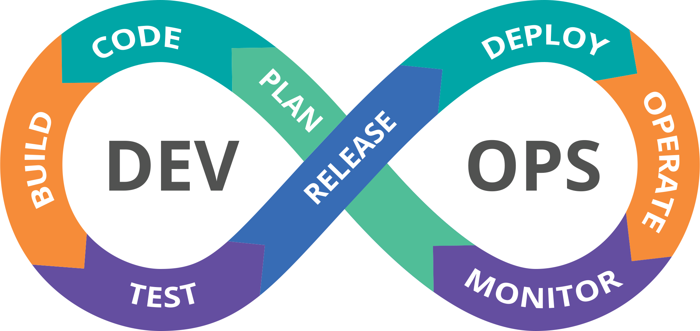
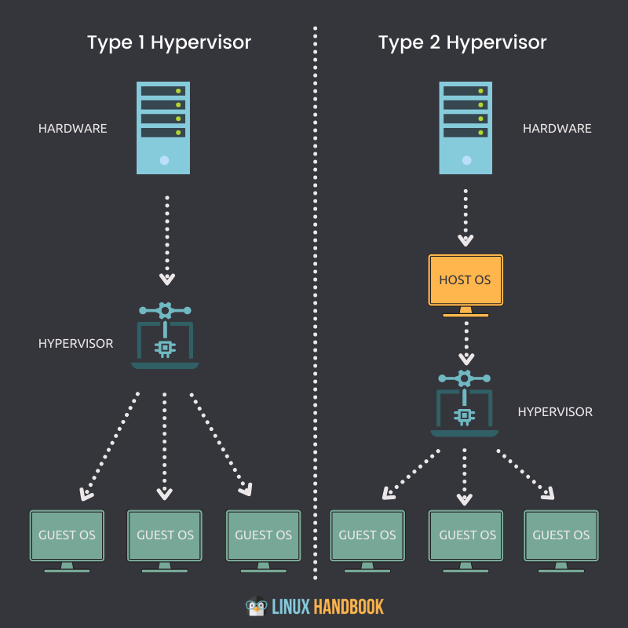

## 100 Days of DevOps

### Description:

The challenge involves committing to learning and implementing DevOps principles for 100 consecutive days and sharing my progress with the DevOps community on GitHub, Medium, and my personal blog on my portfolio

### Goals:

The goal of the challenge is to help me enhance their skills and knowledge in DevOps practices, gain hands-on experience with relevant tools, and build a strong network of peers in the DevOps community. 

Through daily commits and sharing progress with others, I can hold myself accountable and track my progress throughout the challenge.

The 100 Days of DevOps challenge is an excellent opportunity for developers and IT professionals to advance their careers and stay up-to-date with the latest industry trends. 

By participating in the challenge, individuals can improve their understanding of DevOps principles, enhance their problem-solving skills, and build a portfolio of DevOps projects that they can showcase to potential employers.

### Sources:

A big thanks to techworld with Nana that delivers a greate content to achive my Devops Journey.
Check it out at [Techworld with Nana][def]

[def]: https://techworld-with-nana.teachable.com/courses

### Table of Contents

### 2. Operating Systems & Linux Basics
1. [1 - Introduction to Operating Systems](#introduction-to-operating-systems)
2. [2 - Introduction to Virtualization & Virtual Machines](#introduction-to-virtualization-&-virtual-machine)
3. [3 - Setup a Linux Virtual Machine](#setup-virtual-machine)
4. [4 - Linux File System](#linux-file-system)
5. [5 - Introduction to Command Line Interface (CLI - Part 1)](#introduction-to-command-line-interface-part-1)
6. [6 - Basic Linux Commands (CLI - Part 2)](#basic-linux-commands-cli-part-2)
7. [7 - Package Manager - Installing Software on Linux](#package-manager-install-software-on-linux)
8. [8 - Working with Vim Editor](#working-with-vim-editor)
16. [16 - Networking](#networking)
17. [17 - SSH - Secure Shell](#ssh-secure-shell)

### 3. Version Control with Git
1. [1 - Introduction to Version Control and Git](#introduction-to-version-control-and-git)
2. [2 - Basic Concepts of Git](#basic-concepts-of-git)
3. [3 - Setup Git Repository Remote and Local](#setup-git-remote-and-local)

### Bonus. Databases
1. [1 - Databases in development process](#databases-in-development-process)
2. [2 - Database Types](#database-type)

### 4. Build Tools and Package Manager Tools
1. [1 - Introduction to Build Tools](#introduction-to-build-tools)
2. [2 - Install Build Tools](#install-build-tools)
6. [6 - Build an Artifact](#build-an-artifact)
7. [7 - Build Tools for Development](#build-tools-for-development)
8. [8 - Run the Application](#run-the-application)
9. [9 - Build JS Applications](#build-js-application)
10. [10 - Common Concepts and Differences of Build Tools](#common-concepts-and-differences-of-build-tools)

### 5 - Cloud & Infrastructure as Service Basics with DigitalOcean
1. [1 - Intro to Cloud & IaaS](#intro-to-cloud-and-iaas)
2. [2 - Setup Server on DigitalOcean](#setup-server-on-digitalocean)
3. [3 - Deploy and run application artifact on Droplet](#deploy-and-run-application-artifact-on-droplet)
4. [4 - Create and configure a Linux user on a cloud server](#create-and-configure-linux-user-on-cloud-server)

## Contents

### 2. Operating Systems & Linux Basics 

#### 1. Introduction to Operating Systems 
**What is operating system?**
    
Operating System (OS) is a software managing: 
- computer hardware,
- software resources
- and provides common services for computer programs

OS as abstraction layer between applications and hardware. Which means that instead of applications (like browser) interacting with the computer hardware directly, they can use the OS as abstraction layer between the two

**Tasks of an Operating System**
1. Resource Allocation and Management
    - Process Management (CPU)
    - Memory Management (RAM): Allocating working memory (RAM = Rapid Access Memory) to applications
    - Storage Management (Hard Drive): Persisting data long-term, like files, browser configurations, games, pictures, videos etc

2. File Management
    - Files are stored in structured way A file system is organized into directories
    - On Unix system: tree file system
    - On Windows OS: multiple root folders

3. Device Management
    - Manages device communication via their respective drivers
    - Monitor, keyboards, mouse, printers, etc.

4. Other important tasks
    - Security:
        - Managing Users and Permissions
        - Each user has its own space and permissions
    - Networking:
        - Ports and IP addresses
        - Transmitting outgoing data from all application ports onto the network, and forwarding arriving network packets to processes

**Operating System Components**
1. Kernel
    - Heart of every OS
    - The core program that provides basic services for all other parts of the OS
    - Consists of device drivers, dispatcher, scheduler, file system etc.
    - Controls all hardware resources via device drivers
    - Kernel starts the process for app, Allocates resources to app, Cleans up the resources when app shuts down
2. Application Layer:

On the top is kernel is the application layer. For instance:

- For example different Linux distributions: Ubuntu, Mint, CentOS, Debian. Different application layers, but based on same Linux kernel
- Android is also based on **Linux kernel**
- MacOS and iOS is based on a different Kernel called **Darwin**

3. How to interact with Kernel
- Graphical User Interface (GUI)
- Command-Line Interface (CLI)

**3 Main Operating Systems**
- Linux, Windows, Mac OS

**Client OS vs Server OS**
CLient OS:
    - For personal computers with GUI and Input/Output (I/O) devices

Server OS:
    - Linux and Windows have server distributions
    - But Linux most widely used
    - More light-weight and performant
    - No GUI or other user applications

**Why Linux is a must for Devops Engineer**
- Linux is mostly used OS for servers!
- Known Linux is a must for DeVops Engineer

#### 2. Introduction to Virtualization & Virtual Machines 

**What is a Virtual Machine?**
- **Virtual Machine (VM)** is a virtual computer running on top of another host computer
- **How it works**: Virtualization:
    - Virtualization is the process of creating a software-based, or "virtual" version of a computer, with dedicated amounts of CPU, memory, and storage that are "borrowed" from a physical host computer.
    - Makes it possible that any OS can run on top of any other physical host machine
    - The VM is partitioned from the rest of the system, meaning it's completely isolated and can't interfere with the host computer's primary OS
- **Hypervisor**: 
    - The **essential component in the virtualization stack** is a piece of software called a **hypervisor**
    - One of the most popular hypervisor is open-source **Oracle VM VirtualBox**
- **Host OS vs Guest OS**
    - **Host OS**: runs directly on the hardware
    - **Guest OS**: runs on the virtual machine
- **Hypervisor Types**:
    - Type 1 - Native or Bare Metal:
        - That run directly on the host's hardware to control the hardware, and to monitor the guest OS. The guest OS runs on a separate level above the hypervisor.
        - Examples of this classic implementation of VM architecture are Oracle VM, Microsoft Hyper-V, VMware ESXi.
        - Use Cases:
            - Efficient usage of hardware resources (e.g. cloud provider):
                - Use all the resources of a performant big server 
                - Users can choose any resource combinations
    - Type 2 -  Hosted
        - Designed to run within a traditional OS
        - A hosted hypervisor adds a distinct software layer on top of the host OS, and the guest OS becomes a third software level above the hardware
        - Examples: Oracle VM VirtualBox, VMware Server, Microsoft Virtual PC, KVM, QEMU and Parallels.
        - Use Cases:
            - Learn and experiment
            - Test your app on different OS
            - Backing up your existing OS

- Review Type 1 and Type 2 of Hypervisor on the image below:

**Benefits of a Virtual Machine, Why companies adopt Virtualization**
- Main benefit: Instead of OS being tightly coupled to the hardware, Virtualization gives an abstraction layer, with the following benefits:
    - Security: Secure very easily
    - Agility and speed: Spinning up a VM is easy and quick, compared to setting up an entire new server Cost savings: Efficient usage of hardware resources
    - Portable: OS as a portable file (VMI - Virtual Machine Image)
- VMI:
    - Includes OS and all applications on it 
    - You can have backups of your entire OS

#### 3. Setup a Linux Virtual Machine 
- You can just work in terminal on the Mac
- Or, create a Ubuntu VM on Digital Ocean

#### 4. Linux File System 
- Plug in a USB => `/media`
- Change configs => `/etc`
- Install app => `/bin`, `/lib`, ...

#### 5. Introduction to Command Line Interface (CLI - Part 1) 
GUI and CLI acre two ways to interact with operating system. 
**GUI vs CLI**
- GUI = A graphical user interface, where we have graphical elements that you can interact with, like buttons
- CLI = Command Line Interface, where users type in commands and see the results printed on the screen
    - Terminal = the GUI window that you see on the screen. It takes commands and shows output
    - **On servers you only have the CLI, no GUI**
**Why CLI over GUI?**
- Work more efficient 
- Easier for bulk operations 
- CLI is more powerful

#### 6. Basic Linux Commands (CLI - Part 2) 
General Operations:
    
    - clear = Clears the terminal

Directory Operatings:
    
    - pwd = Show current directory. Example Output: /home/nana
    - ls = List folders and files. Example Output: Desktop  Downloads  Pictures  Documents
    - cd [dirname] = Change directory to [dir]
    - mkdir [dirname] = Make directory [dirname]
    - cd .. = Go up a directory

File Operations:
    
    - touch [filename] = Create [filename]
    - rm [filename] = Delete [filename]
    - rm -r [dirname] = Delete a non-empty directory and all the files in it
    - rm -d [dirname] or rmdir [dirname] = Delete an empty directory

Navigating in the File System:

    - cd usr/local/bin = Navigate multiple dirs (relative path - relative to current dir). Move to bin directory
    - cd ../.. = Move up 2 hierarchies, so go to 'usr' directory
    - cd /usr = Alternative to go to 'usr' directly (absolute path)
    - cd [absolute path] = Move to any location by providing the full path
    - cd /home/nana = Go to my home directory (absolute path)
    - cd ~ = Shortcut alternative to go to home directory
    - ls /etc/network = List folders and files of 'network' directory

More File and Directory Operations

    - mv [filename] [new_filename] = Rename the file to a new file name
    - cp -r [dirname] [new_dirname] = Copy dirname to new_dirname recursively meaning including the files
    - cp [filename] [new_filename] = Copy filename to new_filename

Some more useful commands

    - ls -R [dirname] = Show dirs and files but also sub dirs and files
    - history = Gives a list of all past commands typed in the current terminal session
    - history 20 = Show list of last 20 commands
    - CTRL + r = Search history
    - CTRL + c = Stop current command
    - CTRL + SHIFT + v = Paste copied text into terminal
    - ls -a = See hidden files too
    - cat [filename] = Display the file content
    - cat .bash_history = Example 1: Display the file content
    - cat Documents/java-app/Readme.md = Example 2: Display the file content

Display OS Information

    - uname -a = Show system and kernel
    - cat /etc/os-release =  Show OS information
    - lscpu = Display hardware information, e.g. how many CPU you have etc.
    - lsmem = Display memory information

Execute commands as superuser

    - sudo [some command] = Allows regular users to run programs with the security privileges of the superuser or root
    - su - admin = Switch from nana user to admin

#### 7. Package Manager - Installing Software on Linux 
**How to install software**
- On Windows
    - On Windows you have download installer
    - Wizards that guide you through the installation

- On Linux:
    - On Linux you will install **applications mostly with package manager tools** on CLI

**Introduction to Package Manager**
- Tasks of a Package Manager:
    - Downloads, installs or updates existing software from a repository
    - Ensures the integrity and authenticity of the package
    - Manages and resolves all required dependencies
    - Knows where to put all the files in the Linux file system
    - Easy upgrading of the software.

**Package Manager - pre-installed**
- Package Manager is already included in every Linux distribution
- On Ubuntu, you have APT package manager available. **APT = Advanced Package Tool**
- Package Manager like apt has commands you can use to install, uninstall or upgrade software

**Package Repository**
- A repository is a storage location, where all the software packages are hosted
- Contains thousands of programs
- Package Manager fetches the packages from these repositories
- `sudo apt update`:
    - Pulls the latest changes from the APT repositories
    - The APT package index is basically a database
    - Holding records of available packages from the repositories

**Alternative Package Manager**
- A very similar package manager is APT-GET, which you will often come across
- APT:
    - user friendly
    - Fewer
    - Recommended by Linux distributions
- APT-GET:
    - On Ubuntu, APT-GET also out of the box available
    - Different set of commands
    - You can achieve the same user friendly output, if you use additional command options
    - E.g. "apt search" not available

**Alternative ways to install software**
- Ubuntu Software Center
    - Like an app store
    - A utility for installing, purchasing, removing software in Ubuntu
    - Has a graphical UI, so no need for using the CLI
- Snap Package Manager
    - Snap is a software packaging and deployment system
    - Snap = A snap is a bundle of an app and its dependencies 
    - Snap Store = Provides a place to upload snaps, and for users to browse and install the software
    - Snapcraft = Is the command and framework used to build and publish snaps

**Linux Distribution**
- Debian Based: APT OR APT-GET (package manager)
    - Ubuntu
    - Debian
    - Mint

- Read Hat Based: YUM (package manager)
    - RHEL
    - CentOS
    - Fedora

#### 8. Working with Vim Editor 

**Introduction to Vi and Vim**
- Vi and Vim are built-in text editors in Linux

**Use cases for using text editor in CLI**
- Small modifications can be faster, especially when you are currently working in the CLI
- Faster to create and edit at the same time
- Supports multiple formats
- When working on a server

**Working with Vim**
- Vim has two modes:
    - Insert mode
    - Command mode:
        - This is the default mode
        - You can't edit the text
        - Whatever you type is interpreted as a command 
       - Navigate, Search, Delete, Undo etc.

- `vim {filename}` => open the file name, if it doesn't exist, create a new one.
- **Editing**:
    - `i`: switch to insert mode
    - `dd`: delete a line
    - `d10`: delete 10 lines
    - `u`: undo
    - `0`: jump to the start of line
    - `$`: jump to the end of line
    - `A`: jump to the end of line and switch to insert mode
    - `12G`: go to line 12

- **Saving and quitting**:
    - `:wq`: write file to disk and quit vim
    - `:q!`: quit vim without saving changes

- **Searching and Replacing**
    - `/pattern`: will search the pattern
    - `n`: jump to the match
    - `N`: jump to the previous match
    - `:%s/mystring/my-new-string`: will replace all occurrences of "my-stirng" with "my-new-string"

- Pressing `Escape`, switches you back to **command mode**

#### 16. Networking 

> In this article, we will answer some basic questions about networking, such as:
    >> - How do computer networks work?
    >> - How do computers connect to the internet?
    >> - What is an IP Address and port?
    >> - What is a DNS?

- **LAN (Local Area Network)**
    - Collections of devices connected together in one physical location like home, school, ... etc.
    - Each device has a unique IP (Internet Protocol) address
    - Devices communicate via these IP addresses

- **Switch**: facilitates the connection between all the devices within the LAN
- **Router**: network device to connect devices on **LAN** and **WAN (Wide Area Network)**
    - IP Address of the router is called **gateway**

- **Subnet**: sets of IP addresses range.
- **NAT (Network Address Translation)**:
    - Security and protection of devices within the LAN
    - Reuse IP addresses

- **Firewall**: prevent unauthorized access from entering a private network
        - Which IP address in your network is accessible 
        - Which IP address can access your server
        - For example: You can allow any device access your server
- **What is a port?**: 
    - Every device has a set of ports
    - Each port is unique on a device
    - You can allow specific ports (doors)
    - You can allow specific ports (doors) AND specific IP addresses (guests)
    - There are many standard ports for many applications
        - Web servers: Port 80
        - Mysql DB: Port 3306
        - PostgreSQL DB: Port 5432 

- **DNS (Domain Name System)**:
    - DNS is the phonebook of the internet 
    - It translates human readable domain names (for example: www.amazon.com) to machine readable IP addresses
    - **How DNS resolution works**:
        - When you enter a website in a browser, a DNS client on your computer needs to look up the corresponding IP address
        - It queries DNS servers to resolve the name 
        - DNS queries can resolve in different ways

- **Networking Commands**:
    - `ifconfig`: Getting network configuration
    - `netstat`: Network connections, routing tables, interface statistics
    - `ps aux`: Tool to monitor processes running on your Linux system
    - `nslookup`: Query DNS lookup name
    - `ping`: test network connection

#### 17. SSH - Secure Shell 
- Some Use Cases of SSH:
    - Copy file to remote server
    - Install software on new server

- SSH is a protocol that gives users a secure way to access a computer over the Internet.

- **How it works:**
    - The protocol works in the client-server model
    - Meaning you use a program on your computer (SSH client) to connect to the remote server (SSH server)
    - For that you can use a graphical user interface, but mostly the CLI

- **2 ways to authenticate**
    - Use **username** and **password** by creating a user on remote server
    - SSH Key Pair: `Key Pair = Private Key + Public Key`
        - **Private Key** = Secret key. Is stored securely on the client machine (your computer)
        - **Public Key** = Public. Can be shared, e.g. with the remote server (sever or cloud provider)

### 3. Version Control with Git

#### 1. Introduction to Version Control and Git 

- Git control is an approach for team of developers working together
- Git knows how to mnerge automatically
- **Merge conflict** when same line was changed
- Best practice: push and pull often from remote repo

>> Continuous Integration: intergrate your code changes frequently

#### 2. Basic Concepts of Git 
- Remote Git Repository: where the code is hosted, e.g. on **Gitlab** or **GitHub**
- Local Git Repository: local copy of the code on your machine
- Git Client: to connect and execute git commands can be UI or Command Line Tool

#### 3. Setup Git Repository Remote and Local 

**Some Git Commans that I think they are useful:**
- To show commit log: 
    - `git log`
- Gitignore:
    - `git rm -r --cached [filename/foldername]`: remove file/folder already in tracking.
- Git Stash: for work-in-progress branch
    - `git stash`: to store your changes somewhere
    - `git stash pop`: to add the changes back to your branch
- To undo/revert  commit:
    - `git reset --hard HEAD~1`: 1 - number of commits to reset, the change will be removed
    - `git reset --soft HEAD`: undo commit but keep the changes
- When the changes belong to previous commit:
    - `git commit --amend`: instead of creating a new commit, it will merge the changes to the previous commit
- To undo / revert a commit, or remove a commit in remote repository:
    - First, revert or redo a commit by `git reset --hard HEAD~1` => remove old commit
    - Then `git push --force`, need to add `force` to override the commit in remote repository
    - An alternative approach, `git revert <commit ID or hash>` => creates a new commit to revert the old commit's changes.
- Merge Branches: `git merge <branch>`
    - First, need to pull the latest commit from the remote master to local master branch
    - Then, `git merge master` the local master branch to the feature branch.

**Git for DevOps**
- Infrastructura as code
    - Many Kubernetes Configuration Files. Deployment to Kubernetes
    - Terrform and Ansible COnfiguration Files
    - Bash or Python scripts
    - Files should be:
        - Tracked - history of changes
        - Securely store in one place
        - Shareable for DevOps team.
- CI/Cd Pipline and Build Automation
    - Checkout code, test and build application, etc.
    - Need integration btween the build automation tool and application git repository.

### Bonus - Databases
#### 1 - Databases in development process 
**How does databases connect to your application?**
- DB endpoinbts & credentials should not be hard-coded
- Define in 1 place as environment variables
- Configure from outside
- Depending on environment DEV, TEST, PROD

#### 2 - Database Types 
**Database Types**
- Key Value Database: 
    - unquie key, no joinn, in memory
    - Very fast
    - Limited storage
    - No primary DB
    - Best for:
        - Caching
        - Message queues
- Wide column Database:
    - Popular database: Cassandra, HBase
    - Schema less
    - Scalable
    - No Joins
    - Best for:
        - Tim-series
        - IoT-RECORDS
        - HISTORICAL-RECORDS
- Document Databases:
    - Popular database: MongoDB, DynamoDB, CouchDB
    - Schema less
    - Collections
    - No Join and slower than relational DB
    - Faster to read
    - Best for:
        - Mobile Apps
        - Games
        - Content Management
        - Most Apps
- relational Database:
    - MySQL, PostgreSQL
    - Most widely used
    - To store stuctureed data
    - Schema and data types need to be created first
    - SQL
- GraphQL Database
    - Redis
- Search Database
    - Search database through massive data entries

### 4. Build Tools and Package Manager Tools
#### 1 - Introduction to Build Tools 

**What are Build and Package Manager Tools?**
- Application needs to be deployed on a production server. 
- For that, we want to package application into a single moveable file (artifact), also called "building the code"
- This is what a build tool or package manager tool does

**What is an "artifact"?**
- **What is an "artifact"?** Includes application code and all its dependencies
- **What does "building the code" mean?** 
    - Compiling the code
    - Compressing the code
    - Package hundred of files to 1 single file
- **What is an "artifact repository"?** Keep artifact in storage (artifact repository) to deploy it multiple times, have backup, etc. in dev, test and production env
- **What kind og file is the artifact?**
    - Java **JAR or WAR file**
    - JavaScript's artifact can be a **zip or tar file**

#### 2 - Install Build Tools 
- Install Java. Download from `https://www.java.com/en/download/`
- Install Maven. Download `brew install maven`. Check if it has already been installed `mvn -version`
- Install Node + npm. Dowload
- Download IntelliJ

#### 6 - Build an Artifact 
- **Build an Artifact**
    - "Build" Process in Maven or Gradle:
        - Installs dependencies
        - Compiles and compresses your code
    - Example Build Tools for Java: 
        - Gradle: to run java gradle app `./gradlew build`, file `java-maven-app-1.1.0-SNAPSHOT.jar`
        - Maven: to run maven app `mvn install`, file `java-app-1.0-SNAPSHOT.jar`
    - Artifact: JAR or WAR file

- Different Build Tools for different programming languages
    - Java Build Tools: Gradle and Maven
    - JavaScript Package Manager: npm

#### 7 - Build Tools for Development 
- A build tool is used to manage dependencies of a project

#### 8 - Run the Application 
- Locally, for example to test: `java -jar <name of jar file>`
- On a deployment server: Copy the jar file to server, where application should run and execute "java -jar" command

#### 9 - Build JS Applications 
- Artifact of a JavaScript application is e.g. a **zip or tar** file
- JS Package Manager: npm and yarn
- `package.json` file for dependencies
- Package manager install dependencies, but not used for transpiling JS code
- JS libraries can be found in npm repository

- **Command Line Tool for npm:**
    - npm install: installs the dependencies
    - npm start: start the application
    - npm stop: stop the application
    - npm test: run test 
    - npm publish: publish the artifact
- **What does the zip/tar artifact file include?**
    - application code, but NOT the dependencies

- Run JavaScript application on server:
    - 1.Copy Zip/Tar file to server 
    - 2.Unpack zip/tar
    - 3.Install dependencies `package.json`
    - 4.Run the application

- To build artifact: run `npm pack`

**Package Frontend Code**: React Frontend Code
- Frontend/React Code needs to be transpiled into browser compatible code
- Code needs to be compressed/minified, compressed JS and CSS files for faster performance in browser
- Build Tools/Bundler for Javascript Frontend, for example **webpack** transpiles | minifies | bundles | compresses the code

#### 10 - Common Concepts and Differences of Build Tools 
- Java: maven | gradle
- JavaScript: npm | yarn | webpack 
- Python: pip
- C/C++: conan
- C#: NuGet
- Golang: dep
- Ruby: RubyGems

#### Wrap up
- Java Gradle App:
    - Build artifact: `./gradlew build`
    - Test: `./gradlew test`
    - Clean: `./gradlew clean`
    - Start application: `java -jar bootcamp-java-project-1.0-SNAPSHOT.jar`

### 5 - Cloud & Infrastructure as Service Basics with DigitalOcean
#### 1 - Intro to Cloud & IaaS 

- **What is Infrastructure as a Service (IaaS)?**
    - Move your physical infrastructure to cloud 
    - You just rent the servers on demand

- **What is Cloud Computing?**
    - Cloud Computing is the delivery of computing services - including servers, storage, databases, networking, software - over the internet ("the cloud")
    - IaaS is 1 of 4 types of cloud services. Others: Software as a Service (SaaS), Platform as a Service (PaaS) and Serverless

- **Infrastructure as a Service Providers**
    - AWS
    - Digital Ocean
    - Miscrosoft Azure
    -  Google Cloud

#### 2 - Setup Server on DigitalOcean 
- server on DO is called a droplet
- Better practice: 
    - Connect to server with SSH pblic key from your local machine
    - Creata firewall

#### 3 - Deploy and run application artifact on Droplet 

- Example for Java (Gradle) and React Application
- In local machine:
    - Use built tool to create artifact: `./gradlew build`
    - Copy the artifact to remote server on DO: `scp <jar file path> root@159.89.1.9.211:/root`
    - On  DO server, run java application `java -jar <the jar file>`
    - To check if the application is running on DO:
        - `ps aux | grep java`
        - `netstat -lpnt`

#### 4 - Create and configure a Linux user on a cloud server 
- Security best practices:
    - Create seperate user for every application, avoid using root user
    - Create new user: `adduser <user>`
    - Change or update permissions, add to **sudo** group: `usermod -aG sudo <username>`
    - Switch to other user: `su - <user>`
        - **$**: Standard Linux user
        - **#**: Root user
    - Assign SSH public key to standard user